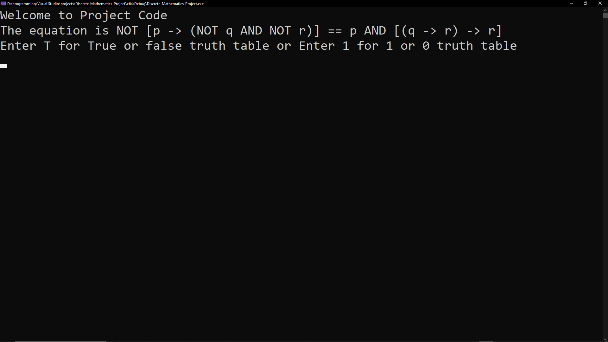
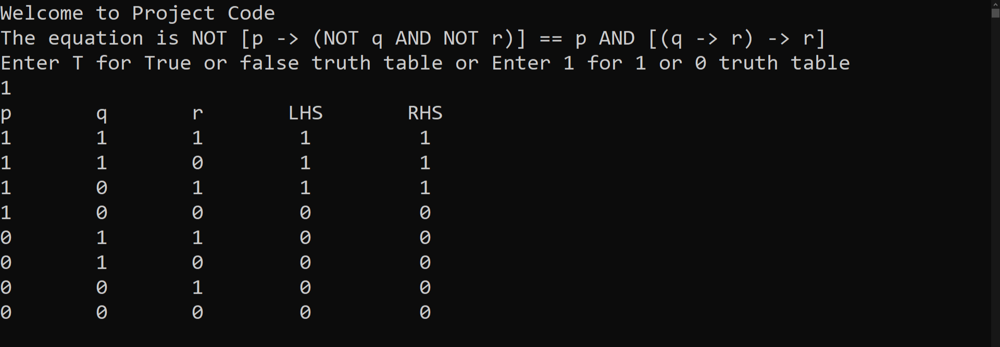
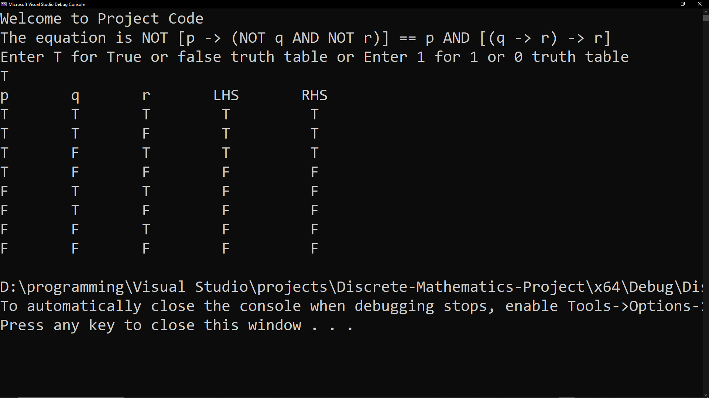

# Discrete Mathematics Project

## About
This project was developed as part of the **Discrete Mathematics** course during the **first semester of the second year** in the **Computer Science** program at **Modern Academy**.

The project is a **Truth Table Generator** implemented in **C++** using **Visual Studio 2022**.

It allows users to generate truth tables and choose how logical values are displayed:
- **0** and **1**
- **T** and **F**

## Features
- Generate truth tables for logical expressions.
- Display truth tables using **0** and **1**.
- Display truth tables using **T** and **F**.
- Allow the user to choose the preferred output format before generating the table.
- Simple and easy-to-use console interface.
- Implemented using C++.

## Technologies
- C++
- Visual Studio 2022

## Team
This project was completed by a team of four Computer Science students.

## Academic Information
- Institution: Modern Academy
- Department: Computer Science
- Course: Discrete Mathematics
- Semester: Second Year – First Semester

## Screenshots

### Main Menu

### Truth Table using 0 and 1

### Truth Table using T and F

## Documentation

The complete project report can be found here:

📄 [Discrete Mathematics Project Report](docs/Discrete_Mathematics_Project_Report.pdf)

## How to Run
1. Open the solution in Visual Studio 2022.
2. Build the project.
3. Run the application.
4. Choose the preferred output format (0/1 or T/F).
5. Generate the truth table.
